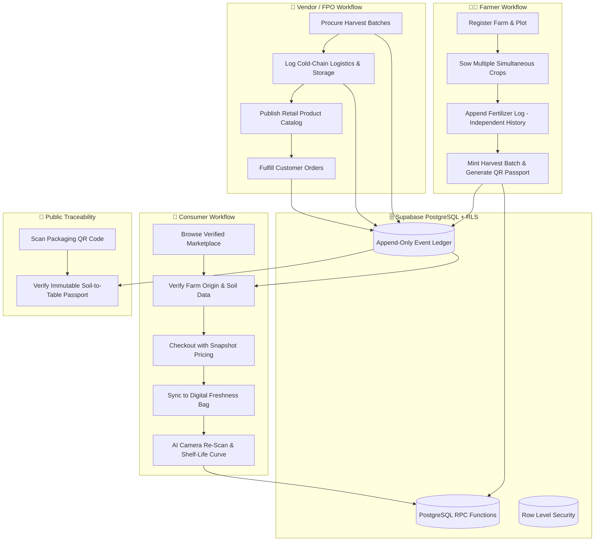

# 🌾 AgriTrace: Soil-to-Table Agricultural Traceability & Freshness Platform

**AgriTrace** is a next-generation agricultural supply chain and food freshness platform. It connects **Farmers, Vendors, and Consumers** with cryptographically verifiable batch passports, independent fertilizer application audit trails, AI-assisted quality grading, calibrated shelf-life uncertainty intervals, and a dynamic Digital Freshness Bag.

Built with **Next.js 14 App Router, Tailwind CSS, TypeScript, Express, Supabase PostgreSQL, and Row-Level Security (RLS)**.

---

## 📑 Table of Contents

- [Platform Architecture & System Workflow](#-platform-architecture--system-workflow)
- [Key Features by User Role](#-key-features-by-user-role)
  - [1. Farmer Portal](#1-farmer-portal)
  - [2. Vendor & FPO Portal](#2-vendor--fpo-portal)
  - [3. Customer & Consumer Portal](#3-customer--consumer-portal)
  - [4. Public Cryptographic Traceability](#4-public-cryptographic-traceability)
  - [5. Decoupled AI Microservice Adapters](#5-decoupled-ai-microservice-adapters)
- [Database Architecture & Security](#-database-architecture--security)
  - [PostgreSQL Schema & RLS Isolation](#postgresql-schema--rls-isolation)
  - [Transactional Stored Procedures (RPCs)](#transactional-stored-procedures-rpcs)
  - [Tamper-Proof Ledger Triggers](#tamper-proof-ledger-triggers)
- [API Endpoints Reference](#-api-endpoints-reference)
- [Multilingual Support](#-multilingual-support)
- [Installation & Quickstart Guide](#-installation--quickstart-guide)
- [Automated Testing](#-automated-testing)

---

## 🏗️ Platform Architecture & System Workflow



---

## 🌟 Key Features by User Role

### 1. Farmer Portal
- **Simultaneous Multi-Crop Management**: Track multiple active crops across different plots independently (e.g., Tomato Plot A, Onion Plot B, Potato Plot C) without cross-contamination.
- **Hierarchical Farm & Plot Structure**: Define farm boundaries, soil classifications (e.g. *Deep Black Cotton Clay Loam*), irrigation systems (micro-drip, solar drip), and tensiometer sensors.
- **Independent Timestamped Fertilizer Audit Trail**:
  - Repeated applications of fertilizers or bio-nutrients (*Jeevamrut, Vermicompost, Urea, DAP*) create separate chronological ledger entries.
  - Editing an individual record updates only that targeted entry without overwriting historical logs.
  - Computes cumulative NPK ratios and total nutrient input costs per crop.
- **Harvest Batch Passport Minting**:
  - Atomically mints verifiable batch codes (`BAT-2026-NSK-089`).
  - Generates downloadable, print-ready high-resolution QR codes for produce crates.
  - Automatically records the initial immutable `HARVESTED` ledger event.
- **Hyper-Local Agro-Meteorological Telemetry**:
  - Automatically queries Open-Meteo & IMD radar based on saved farm GPS coordinates (`latitude`/`longitude`).
  - Delivers 5-day precision forecasts with **Foliar Spray Window Advisories** (Safe to spray vs. High rain/humidity risk).
- **Farm Notifications & Actionable Advisories**: Alerts for optimal spray windows, harvest readiness, buyer bids, and fertilizer schedule due dates.

---

### 2. Vendor & FPO Portal
- **Direct Farmer Batch Procurement**:
  - Browse verified harvest batches directly from farmers with zero middlemen.
  - Procure quantities with atomic stock deduction and ledger logging (`PROCURED_BY_VENDOR`).
  - Records cold chain transit conditions (temperature, relative humidity).
- **Inventory Stock Ledger**: Real-time stock visibility with manual/automated adjustment reasons (*Spillage, Quality Re-grade, Sales, Transit Loss*).
- **Product Catalog Listing Manager**:
  - Publish retail-ready listings directly linked to parent harvest batches.
  - Set unit prices, inventory quotas, and quality grades (*Grade A+, Grade A, Organic Certified*).
- **Order Fulfillment Pipeline**: Manage incoming consumer orders through a live status workflow (`PLACED` &rarr; `CONFIRMED` &rarr; `DISPATCHED` &rarr; `DELIVERED`).

---

### 3. Customer & Consumer Portal
- **Verified Farm-to-Fork Marketplace**:
  - Search and filter produce by commodity, category (*Vegetable, Fruit, Grain, Organic*), quality grade, and price slider.
  - View vendor details, farm origin proof, and batch passports on every product card.
- **Interactive Single Produce Story**:
  - Explains the complete agronomic background: Farmer name, farm plot location, soil type, irrigation protocol, and harvest date.
  - Displays AI-inspected quality grade and estimated days of shelf life remaining.
- **Cart & Checkout with Price Snapshots**:
  - Locks in snapshot pricing (`unit_price_snapshot`) to protect historical order integrity against future catalog price changes.
  - Free delivery threshold calculations and delivery address management.
- **Digital Freshness Bag (Re-Scan Lifecycle)**:
  - When an order is completed, produce is automatically registered in the customer's **Digital Freshness Bag**.
  - **Live Camera Re-Scan**: Customers take photos of produce over time to monitor freshness degradation.
  - **Calibrated Uncertainty Intervals**: Predicts remaining shelf life with statistical confidence bounds (e.g. `2 days ± 1 day [1, 3]`).
  - **Expiration Alerts**: Prompts the user before produce spoils with tailored storage recommendations (*"Store at 10-12°C in ventilated container"*).

---

### 4. Public Cryptographic Traceability (`/trace/batch/[batchId]`)
- **Universal Public Access**: Anyone scanning a physical QR code on retail packaging can view the complete soil-to-table passport without needing an account.
- **Immutable Timeline Events**:
  - `HARVESTED` &bull; Farmer & Plot harvest timestamp
  - `QUALITY_INSPECTED` &bull; AI Spectrometry grade & chemical residue test
  - `PROCURED_BY_VENDOR` &bull; Cold-chain terminal reception & transit temperature
  - `PACKAGED_AND_LISTED` &bull; Eco-packaging & fulfillment hub dispatch
- **Cryptographic Tamper-Proof Stamp**: Every lifecycle milestone is signed with a deterministic SHA-256 hash.

---

### 5. Decoupled AI Microservice Adapters
The backend defines modular service adapters ([aiAdapters.ts](file:///c:/Users/Vajahat%20Shaikh/OneDrive/Desktop/agritrace/backend/src/services/ai/aiAdapters.ts)) configured to delegate to your standalone Python / FastAPI / PyTorch models without synthetic data fabrication:
- `VisionServiceAdapter.analyze(image)`: Defect detection & quality classification.
- `FreshnessServiceAdapter.predict(input)`: Real-time freshness score (0-100%).
- `ShelfLifeServiceAdapter.predict(input)`: Remaining days with calibrated `[lower_days, upper_days]` prediction intervals.
- `PricePredictionServiceAdapter.predict(input)`: Agmarknet mandi modal price forecasting.
- `RAGServiceAdapter.query(input)`: Contextual crop disease & fertilizer advisory.
- `AgentServiceAdapter.run(input)`: Multi-agent autonomous workflow execution.

---

## 🗄️ Database Architecture & Security

### PostgreSQL Schema & RLS Isolation
The database is structured in Supabase PostgreSQL with strict multi-tenant Row Level Security policies:
- **`farms` & `crops`**: Restricted so farmers can only mutate their own agricultural assets (`farmer_id = auth.uid()`).
- **`fertilizer_applications`**: Append-only log table linking directly to `crop_id` and `farmer_id`.
- **`vendor_inventories` & `vendor_products`**: Managed exclusively by authenticated vendors.
- **`orders` & `cart_items`**: Accessible by the ordering customer and the fulfilling vendor.
- **`freshness_bag_items` & `freshness_scans`**: Private to each customer's freshness dashboard.

### Transactional Stored Procedures (RPCs)
Atomic operations are executed through PostgreSQL stored procedures in [002_transactional_rpcs.sql](file:///c:/Users/Vajahat%20Shaikh/OneDrive/Desktop/agritrace/backend/supabase/migrations/002_transactional_rpcs.sql):
1. `fn_create_harvest_and_batch`: Atomically mints batch codes and creates the initial `HARVESTED` event.
2. `fn_vendor_procure_batch`: Atomically verifies available batch stock, deducts quantity, creates vendor inventory, and writes the `PROCURED_BY_VENDOR` event.
3. `fn_process_checkout`: Deducts inventory stock, creates order records with price snapshots, clears customer cart, and registers items into the Freshness Bag.
4. `fn_rescan_freshness_bag`: Appends freshness scan history and updates remaining shelf life with model metadata.

### Tamper-Proof Ledger Triggers
```sql
CREATE OR REPLACE FUNCTION fn_prevent_traceability_mutation()
RETURNS TRIGGER AS $$
BEGIN
    RAISE EXCEPTION 'Traceability events are immutable and cannot be updated or deleted.';
END;
$$ LANGUAGE plpgsql;

CREATE TRIGGER trg_immutable_traceability
BEFORE UPDATE OR DELETE ON public.traceability_events
FOR EACH ROW EXECUTE FUNCTION fn_prevent_traceability_mutation();
```

---

## 🌐 API Endpoints Reference

### Farmer Routes (`/api/v1/farmer/*`)
| Method | Endpoint | Description |
|---|---|---|
| `GET` | `/dashboard` | Farmer dashboard metrics, weather, and active crops |
| `GET` / `POST` | `/farms` | List and create farm profiles |
| `GET` / `POST` | `/plots` | List and create plots under a farm |
| `GET` / `POST` | `/crops` | List and register active multi-crops |
| `GET` | `/crops/:cropId` | Detailed crop view with fertilizer & harvest logs |
| `POST` | `/fertilizers` | Append independent fertilizer application |
| `PATCH` | `/fertilizers/:id` | Update specific fertilizer application |
| `POST` | `/batches/mint` | Atomically mint harvest batch & generate QR code |

### Vendor Routes (`/api/v1/vendor/*`)
| Method | Endpoint | Description |
|---|---|---|
| `GET` | `/dashboard` | Vendor sales metrics, inventory, and pending orders |
| `GET` | `/inventory` | List warehouse inventory stock ledger |
| `POST` | `/inventory/:id/adjust` | Stock adjustments (spillage, re-grade, loss) |
| `GET` / `POST` | `/procurement` | Procure farmer harvest batches |
| `GET` / `POST` | `/products` | List and create consumer marketplace listings |
| `GET` / `PATCH` | `/orders` | View and fulfill customer orders |

### Customer Routes (`/api/v1/customer/*`)
| Method | Endpoint | Description |
|---|---|---|
| `GET` | `/products` | Public marketplace produce catalog with filters |
| `GET` | `/products/:id` | Detailed produce story & farm origin proof |
| `GET` / `POST` | `/cart` | Get cart and add produce items |
| `PATCH` / `DELETE` | `/cart/:itemId` | Update quantity or remove cart item |
| `POST` | `/orders/checkout` | Place order with snapshot pricing |
| `GET` | `/orders` | Order history & delivery tracking |
| `GET` / `POST` | `/freshness-bag` | Digital Freshness Bag items |
| `POST` | `/freshness-bag/:id/rescan` | Submit camera re-scan with prediction intervals |
| `GET` / `POST` | `/favorites` | Bookmark favorite produce for quick re-ordering |

### Public & System Routes (`/api/v1/*`)
| Method | Endpoint | Description |
|---|---|---|
| `GET` | `/trace/batches/:batchId` | Public Soil-to-Fork immutable timeline |
| `GET` | `/trace/batches/:batchId/qr` | Fetch or stream batch QR code |
| `GET` | `/weather/forecast` | 5-day precision agro-weather forecast |
| `GET` / `POST` | `/notifications` | List notifications and mark as read |

---

## 🗣️ Multilingual Support

AgriTrace includes built-in real-time translation across 5 Indian linguistic formats:
- **English** (`en`)
- **हिंदी (Hindi)** (`hi`)
- **मराठी (Marathi)** (`mr`)
- **தமிழ் (Tamil)** (`ta`)
- **Hinglish** (`hinglish`)

Includes a canonical commodity dictionary mapping local names (*कांदा / Kanda / Pyaz &rarr; Onion, टोमॅटो &rarr; Tomato, संत्रा &rarr; Mandarin Orange, तांदूळ / Basmati &rarr; Rice*).

---

## 🚀 Installation & Quickstart Guide

### Prerequisites
- **Node.js**: v18.0.0 or higher
- **npm** or **yarn**
- **Supabase Account** (or local Supabase CLI instance)

### 1. Clone & Set Up Backend

```bash
cd backend
npm install

# Copy environment template
cp .env.example .env
```

Configure your `backend/.env`:
```env
PORT=5000
FRONTEND_URL=http://localhost:3000
SUPABASE_URL=https://your-project.supabase.co
SUPABASE_ANON_KEY=your-supabase-anon-key
SUPABASE_SERVICE_ROLE_KEY=your-supabase-service-role-key
AI_SERVICE_URL=http://localhost:8000
```

Apply database migrations in your Supabase SQL Editor:
1. Run `backend/supabase/migrations/001_initial_schema.sql`
2. Run `backend/supabase/migrations/002_transactional_rpcs.sql`

Start the backend:
```bash
npm run dev
# Server running on http://localhost:5000/api/v1
```

---

### 2. Set Up Frontend

```bash
cd ../frontend
npm install

# Copy environment template
cp .env.example .env.local
```

Configure `frontend/.env.local`:
```env
NEXT_PUBLIC_SUPABASE_URL=https://your-project.supabase.co
NEXT_PUBLIC_SUPABASE_ANON_KEY=your-supabase-anon-key
NEXT_PUBLIC_API_URL=http://localhost:5000/api/v1
```

Start the Next.js development server:
```bash
npm run dev
# App running on http://localhost:3000
```

---

## 🧪 Automated Testing

### Run Backend Unit & Integration Tests
```bash
cd backend
npm test
```

Test coverage includes:
- ✅ **Fertilizer Application Independent Audit Trail**: Verifies consecutive applications create distinct chronological rows without overwriting.
- ✅ **Traceability Ledger Immutability**: Validates lifecycle milestone sequence and cryptographic hash generation.
- ✅ **TypeScript Compilation**: `npm run build` runs `tsc` with 0 type errors.
- ✅ **Next.js Production Build**: `npm run build` in `frontend` compiles all 23 static & dynamic routes cleanly.

---

## 📄 License
This project is licensed under the MIT License - see the LICENSE file for details.
